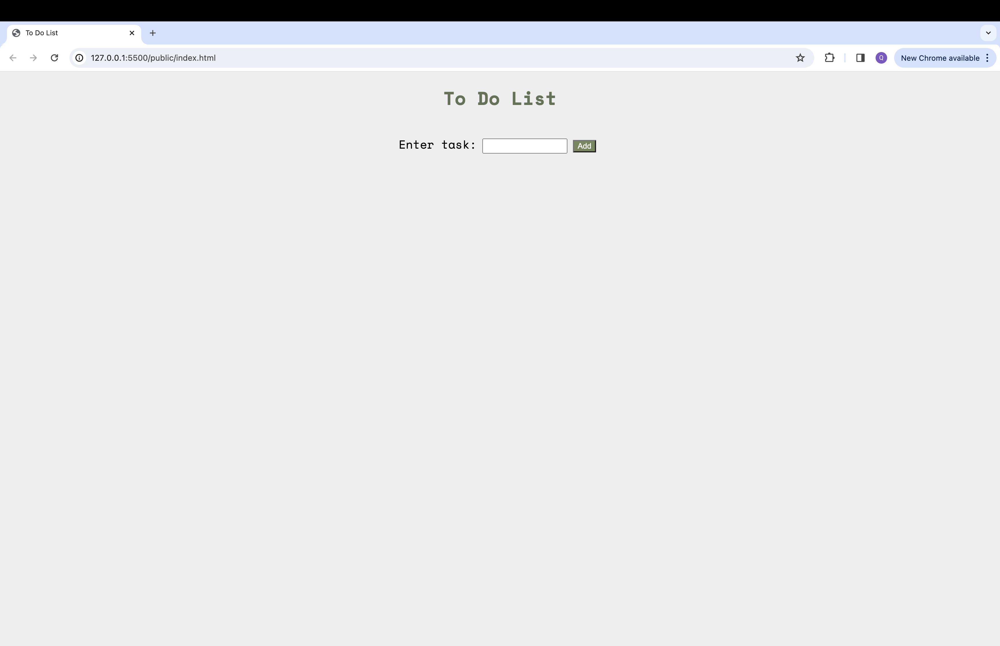
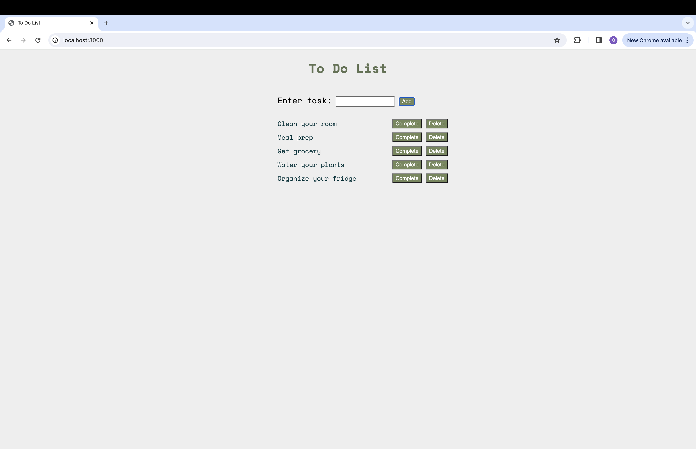
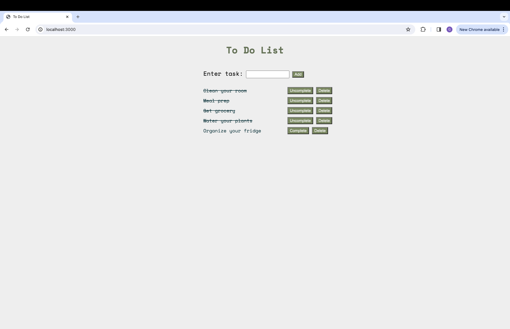

# 📝 To-Do List App

Una aplicación web sencilla para gestionar tareas. Permite agregar, visualizar, marcar como completadas y eliminar tareas, todo desde una interfaz amigable.

## 🚀 Tecnologías utilizadas

- **Frontend:** HTML, CSS y JavaScript
- **Backend:** Node.js con Express.js
- **Almacenamiento:** En memoria (sin base de datos)
- **Servidor:** Puerto `3000`

## ✨ Funcionalidades

- 📋 Ver lista de tareas
- ➕ Agregar nuevas tareas
- ✅ Marcar tareas como completadas
- 🗑️ Eliminar tareas

## 📁 Estructura del proyecto

simple-express-to-do-list-app/
│
├── public/ # Archivos del frontend
│ ├── index.html
│ ├── style.css
│ └── script.js
│
├── server.js # Servidor Express
├── package.json # Dependencias del proyecto
└── README.md # Este archivo


## 🔧 Instalación y uso local

1. Clona este repositorio:
   ```bash
   git clone https://github.com/mecatronabi/to-do-list-app.git
   cd to-do-list-app
   
2. Instala dependencias:
   ```bash
  npm install
  
3. Inicia el servidor:
  ```bash
  node server.js

4. Abre en tu navegador:
  ```bash
  http://localhost:3000


## 🧑‍💻 Autor
  mecatronabi


# Simple To Do List App with Express.js

This project is a simple To Do List application built with Express.js for the backend and plain JavaScript, HTML, and CSS for the frontend. It allows users to create, view, update, and delete tasks. The application serves as a basic example of how to integrate a frontend with a backend using an API.

<br>

## Technology Stack
- <b>Backend:</b> Node.js, Express.js
- <b>Frontend:</b> HTML, CSS, JavaScript
- <b>Middleware:</b> body-parser, serve-static

<br>

## Set Up
To run this project, follow these steps:

1. Clone the repository

```bash
git clone https://github.com/quynhnle135/simple-express-to-do-list-app.git
cd simple-express-to-do-list-app
```

2. Install the necessary packages:

```bash
npm install
```

3. Start the server:

```bash
npm start
```

This will start the server on <b>http://localhost:3000</b>. The API endpoints will be available at <b>http://localhost:3000/tasks</b>.

<br>

## API Endpoints
The server defines the following REST API endpoints:

- <b>GET /tasks</b>: Retrieve all tasks.
- <b>GET /tasks/:id</b>: Retrieve a task by its ID.
- <b>POST /tasks</b>: Create a new task.
- <b>PUT /tasks/:id</b>: Update a task by its ID.
- <b>DELETE /tasks/:id</b>: Delete a task by its ID.

<br>

## Screenshots

Before adding tasks:


After adding tasks:


Completed some tasks:

